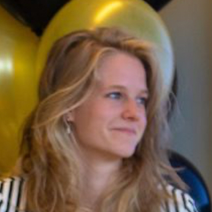

## Wie ben ik?

Tijdens en naast mijn studies heb ik veel creatieve, educatieve en technische kennis opgedaan en ontwikkeld. Deze kennis zet ik graag in om anderen op een leuke manier STEM te laten ontdekken.

## Ervaring
`2022 - nu`
**IT docente**, *Code Café*, Utrecht\
`2022 - 2022`
**Leraar robotica**, *ksg De Breul*, Zeist\
`2018 - 2019`
**Begeleider en leraar web- en gamedevelopment**, *Bomberbot*, Amsterdam, Hilversum, Utrecht\
`2017 - 2018`
**Stagair UX Design voor gamification**, *Liftov*, Utrecht

## Educatie
`2021`
**MEd Psychology of Education**, *The University of Manchester*, Verenigd Koninkrijk\
<ins>Dissertatie:</ins> Primary teachers’ challenges in teaching STEM: from curriculum to classroom\
`2019`
**BSc Communcation and Multimedia Design**, *Hogeschool van Amsterdam*\
<ins>Afstudeerproject:</ins> Digitale planningtool voor leraren ter ondersteuning van hoogbegaafde kinderen
- Bijvakonderwijs: Ontwerpen van leersituaties, *Universiteit Utrecht*
- Extra minor: Visual Communication met Deutsch Kurs (B1) en Spanisch für Anfänger (A1), *Hochschule der Medien*, Duitsland
- Minor: Jeugd en Media, *Hogeschool van Amsterdam*

## Skills

| Technical          | Soft                 |
| ------------------ | -------------------- |
| HTML, CSS          | Samenwerken          |
| Python             | Visualiseren
| Arduino, micro:bit, mBot, Makey Makey, Scratch | Verbanden leggen |
| JavaScript         | Overzicht creëren |
| Adobe Illustrator, Lightroom, InDesign, Premiere Pro, After Effects, Photoshop, Audition | Sociaal

## Talen
### Moedertaal/ gevorderd
- Nederlands
- Engels

### Beginner
- Duits (B1)
- Spaans (A2)
